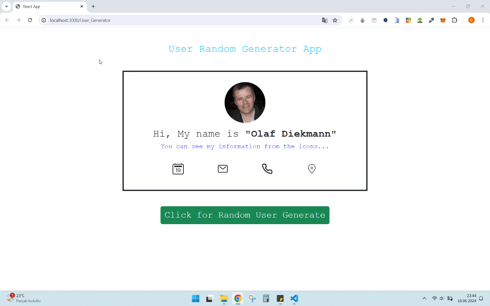

## User GeneratorPage Project

## Description
This project was designed with React. It generates random user information. Fetch API structure is used in useEffect Hook.

## Objective
At the end of the project, following topics are to be covered;
* HTML
* CSS
* JavaScript
* React
* React-Bootstrap / Bootstrap
* React-Deployment

------

Notes For Deployment:
- Packega.json -> "homepage": "https://sakardogukan.github.io/User_Generator",
- in terminal   -> yarn add gh-pages
- Packega.json -> "scripts" ->
    "predeploy": "yarn run build",
    "deploy": "gh-pages -d build"
- in terminal -> yarn run build
-----

### Project Skeleton:

```
    User_Generator (folder)
    |
    |---- public
    |       |---- index.html
    |---- src
    |       |---- compenents
    |       |       |---- Header.jsx
    |       |       |---- User.jsx
    |       |---- scss
    |       |       |---- _reset.scss
    |       |       |---- _variables.scss
    |       |       |---- app.scss
    |       |       |---- header.module.scss
    |       |       |---- user.module.scss
    |       |---- App.js
    |       |---- index.css                                   
    |       |---- index.js                                   
    |       |---- project_view.gif
    |---- .gitignore
    |---- package-lock.json
    |---- package.json
    |---- README.md
    |---- yarn.lock
```

### Project View Images:



> Designed By DOGUKAN © Apr. 2024